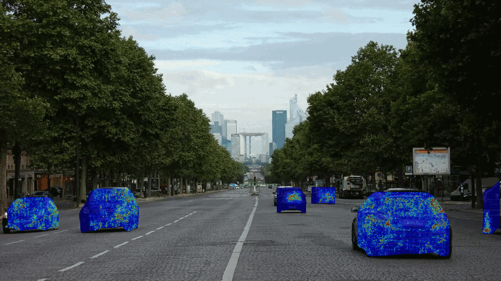

# Pathvision: An Explainable AI Method for Object Detection models

Using an object-specific tracking algorithm with state-of-the-art gradient-based Explainable AI techniques to identify errors in Object Detection models 



Pathvision's only been developed and tested on **Microsoft Windows Only**

## Prerequisites
- Python 3.9+
- pip 22.3.1+
- setuptools 67.7.2+
- Windows C++, C build tools
- PyTorch with CUDA support

## Setup
These instructions are for **Microsoft Windows 10/11** PS and cmd. (May also work on previous versions of Win and I have reasonable faith these will work fine on Unix)

### **Step 0: Clone the repository**
Navigate to the root direction and run:
```bash
git clone https://github.com/toby-j/pathvision.git
cd pathvision
```

### **Step 1: Create venv (Optional but reccomended)**
I reccomend using a venv just for simplisity.
```bash
python -m venv venv
venv/Scripts/activate
pip install .
```
This will run the `setup.py` file which'll install all of Pathvision's dependencies as specified in `requirements.txt`.

### **Step 2: Clone Detectron2**
```bash
cd pathvision/models
git clone https://github.com/facebookresearch/detectron2.git detectron2

```

### **Step 3: Build Detectron2**
This repository is using Detectron2 for image segmentation, this isn't built by default.
Detectron2 requires CUDA to be built. You check check that your installed PyTorch has CUDA enabled with:
```bash
python -c 'import torch; from torch.utils.cpp_extension import CUDA_HOME; print(torch.cuda.is_available(), CUDA_HOME)'
```
If this prints `True` you'll be able to build Detectron2
If it prints false, you may need to reinstall PyTorch with CUDA compute platform enabled, see: [Install PyTorch locally](https://pytorch.org/get-started/locally/).

Unfortuently, I can't find a way to build Detectron2 without CUDA. On Linux you can use the pre-builds, see: ["Detectron2 Docs](https://detectron2.readthedocs.io/en/latest/tutorials/install.html)

Navigate to the Detectron2 folder:
```bash
cd pathvision/models/detectron2
pip install .
```
We've now built and install the dependencies for Pathvision.

## Running
There's a `tester.py` file which creates an instance of Pathvision's Object Detection feature and runs a predefined test using images from `debug/test_data`.
If you want to use your own test images, simply add a folder in `debug/test_data` and change the folder path of `frame_list_dir` in `tester.py` to the folder containing your test images (.jpg and .png are both supported).

You can select either `VanillaGradients`, `IntegratedGradients` or `Smoothgrad`. If you want fast results, usually a minute or so per frame, use vanilla gradients. Smoothgrad is usually a couple of minutes. Integrated Gradients is *much* more computationaly expensive, but is supported.

To view results, the output images will be written to `debug/final_output` and `debug/output_image`. Errors will be written in the `debug/log` folder.
